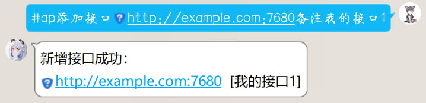

# 绘图接口部署相关说明

返回主文档请点左上角。

Stable Diffusion：下称SD

AP-Plugin所有涉及到生成图片的功能（包括以文生图，以图生图，二次元的我）都需要通过请求SD提供的api接口来实现。因此，要使用这些功能，就需要配置一个可用的SD接口。

不同于常见的“一言”、“天气”、“笑话”等单纯请求和响应文本的接口，AI绘图需要大量算力，成本会高很多。因此，几乎不会存在全网公开的可供任意调用的SD绘图接口（不排除家里有矿的富佬做慈善的可能）。

AP-Plugin不提供SD接口，您可以通过下面介绍的方式，自行获取接口来使用。

-   **蹭接口**：假设你身边有人部署了SD，他又愿意让你使用他的接口，那么直接拿来用即可。目前群内限量有偿提供SD接口。
-   **自己部署SD**：您可以通过1.将SD**本地部署**在你自己的电脑上，或者2.**部署在购买的云服务器**上的方式，来获取自己的SD绘图接口。使用SD一键包来部署，其过程十分简单。

## 关于部署SD

关于部署Stable Diffusion，可查看此文档：[**配置绘图【Stable Diffusion】参考文档**](https://www.wolai.com/rMR9bFJehYhBKdQT6dY3zL#jUC8wjHf9mF9ynXgQNSC1b "配置绘图【Stable Diffusion】参考文档")

部署SD的两种方式：本地部署 和 云服务器部署，有各自的优缺点，可根据自身条件选择：

**本地部署**

1.  需要16系及以上、6G显存起步的显卡
2.  本地部署不需要花费额外的服务器租赁费用，除开电费外，没有额外成本
3.  绘图期间显卡接近满负载，取决于你的显卡功耗，会带来不同程度的额外电费开销
4.  仅当电脑开启且运行SD的时候才能使用
5.  当你的机器人部署在本地 服务器时，需要内网穿透才能使机器人调用到你家中本地部署的SD接口

**云服务器部署**（特指GPU型服务器）

1.  适用于手中没有合适显卡的情况
2.  需要额外承担一笔租赁GPU云服务器的成本                                  　　.
3.  SD运行在云服务器上，不会造成额外的电费开销               .
4.  云服务器7x24小时运行，随时可画图
5.  云服务器拥有公网ip，机器人可在任意地方访问到部署在云服务器上的SD绘图接口

~~如果要买GPU云服务器，可以点这个~~[~~https://url.cn/jSQozOpK~~](https://url.cn/jSQozOpK "https://url.cn/jSQozOpK")~~链接去买腾讯云的\~\~\~\~GPU计算型 GN7\~\~\~\~服务器，目前是0.5折限时优惠阶段，很大的折扣力度。这个型号搭载的T4显卡拿来绘图一个人用算力可能会有很多富余，所以正如上面提到的，拼团会是个不错的选择。~~ 0.5折优惠活动已经结束，目前不再推荐购买GPU服务器，建议考虑其余方式

另外，**部署的stable diffusion作为接口来使用时，需要添加启动参数- -api，才能被ap-plugin正确调用**

当你已经有了一个可以用的绘图接口，那么最后，发送如下指令即可快速配置接口：

> 📌#ap添加接口接口地址备注这里给接口写一个备注方便区分

（黄色背景部分自行替换）

QQ交流群号：621069204
