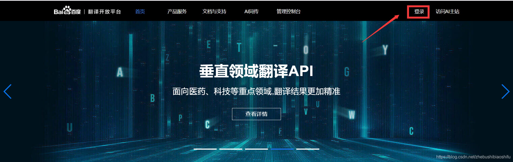
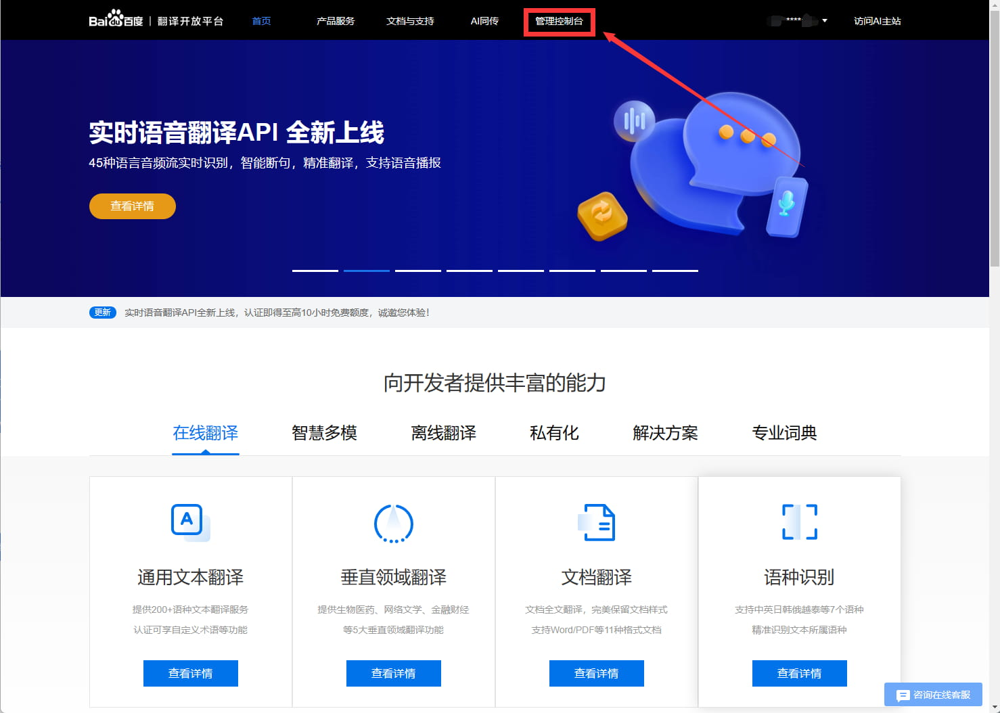
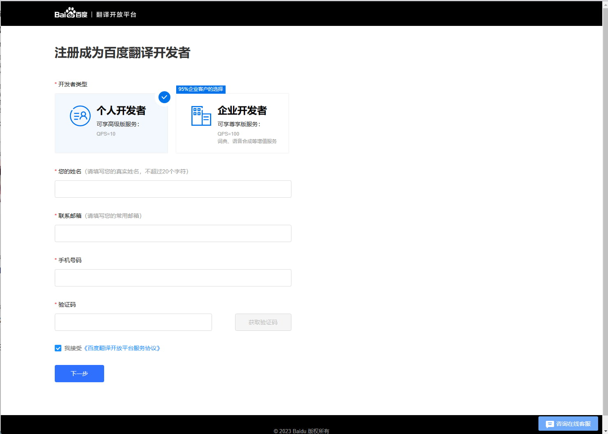
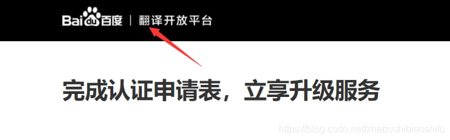
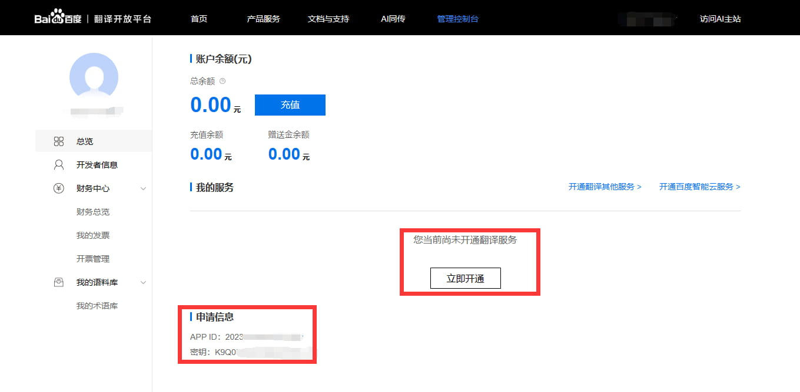
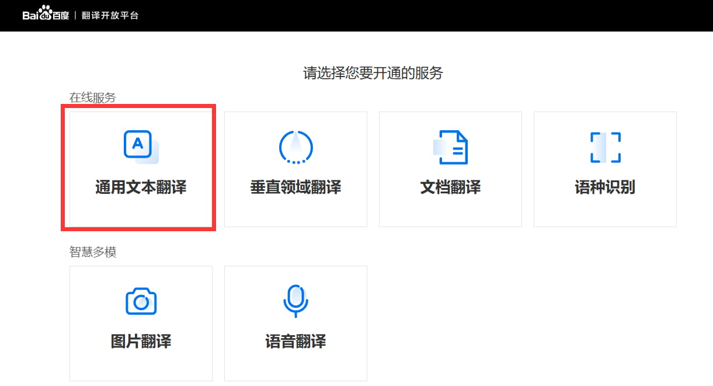
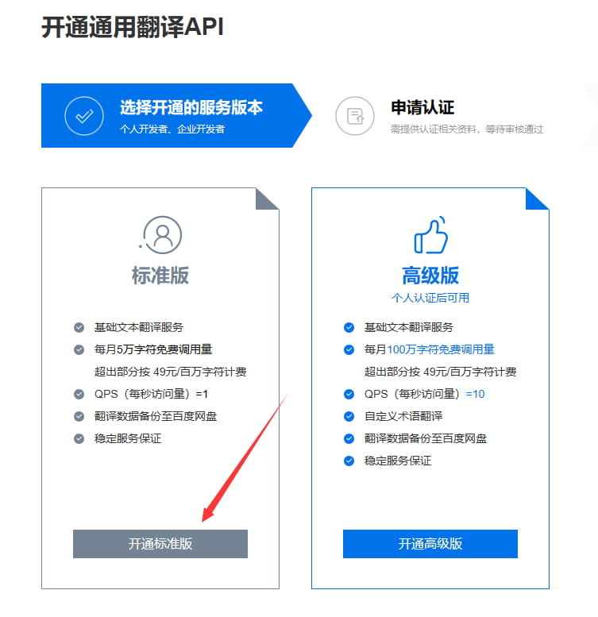
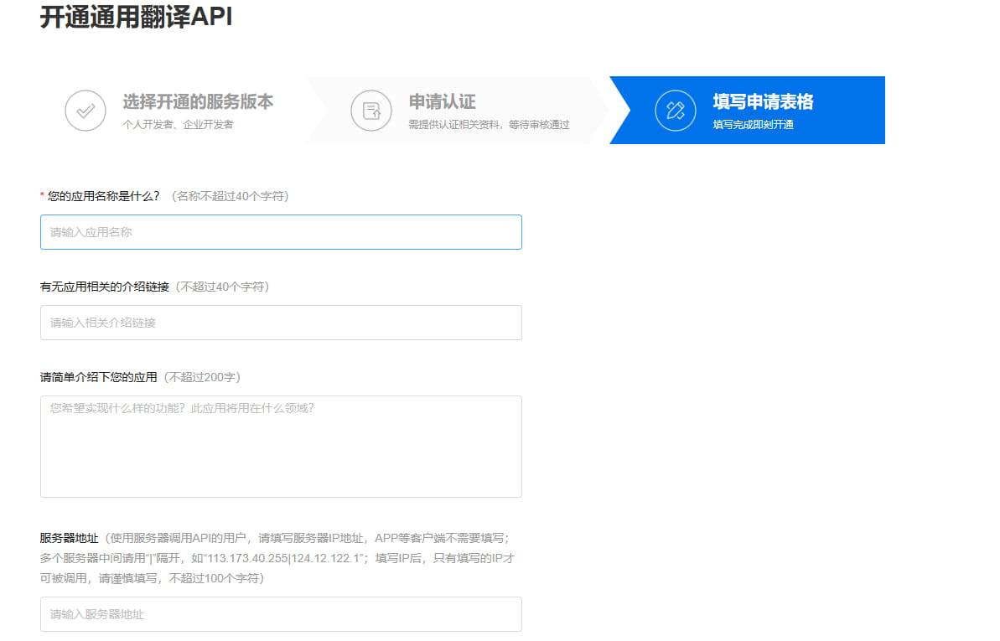
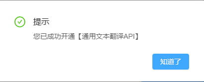
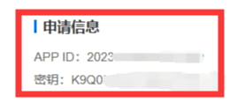

# 百度翻译服务配置文档

## 1.[点我进入](https://fanyi-api.baidu.com/ "点我进入")百度翻译开放平台，首先点击右上角进行登录。

## 2.登录后，选择“管理控制台”。

## 3.首次进入“管理控制台”，需要首先注册为百度翻译的开发者身份。在这里，我们选择

## “个人开发者”，并填写相关信息。

## 4.注册成功后，弹出一个提示进行身份认证的窗口；依据大家的需要选择是否要进行身份认证。建议大家还是选择“确定”，因为可以看一下认证与否对于我们翻译接口的影响。

## 5.如下图，可以看到如果认证了个人身份，即可使用高级版的翻译接口。

TI0\~4Z733_H9WtU85fkW.jpg)

## 6.随后，在这一界面点击上方“翻译开放平台”按钮，回到主页。

## 7.再次点击管理控制台可以看到，此时“管理控制台”中已经有了我们账户的信息，同时接口API以及密钥已经显示在了左下角红色圈内部分。继续点击立即开通

## 8.选择通用文本翻译

## 9.选择我们需要开通的服务或功能。在这里，我选择标准版，大家如果需要高级版就选择右侧即可。

## 10.选择完成后填写申请表格

## 注意是服务器调用api的用户请填写服务器IP地址

## 点击提交申请即成功开通百度翻译服务

## 11.配置key

输入你刚刚获取到的APPID和密钥

发送如下指令来配置：

-   \#ap设置百度翻译id你刚才获取的APP ID
-   \#ap设置百度翻译key你刚才获取的密钥

&#x20;  然后重启机器人即可

本篇教程By——小花花花儿（860563585）
