# 百度图片审核服务配置文档

**1.**[**点我进入**](https://console.bce.baidu.com/ai/?fromai=1#/ai/antiporn/overview/index "点我进入")**百度云内容审核控制台，找到“免费尝鲜”，点“****去领取****”**

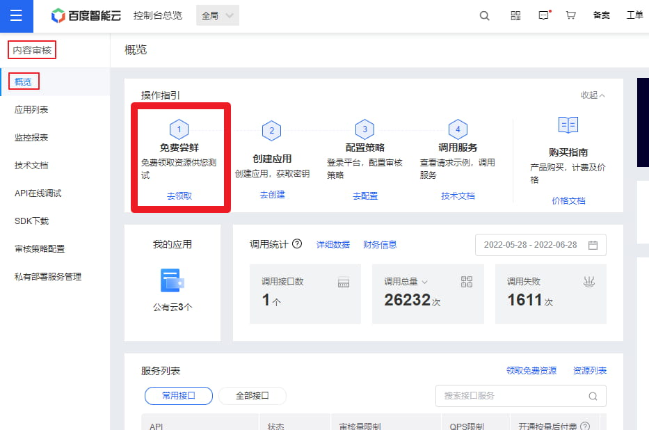

**2.勾选“内容审核平台-图片”，零元领取**

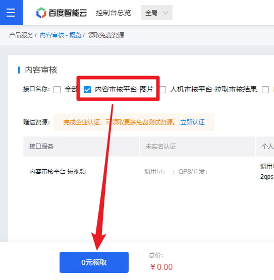

**3.回到概览，点“创建应用”**

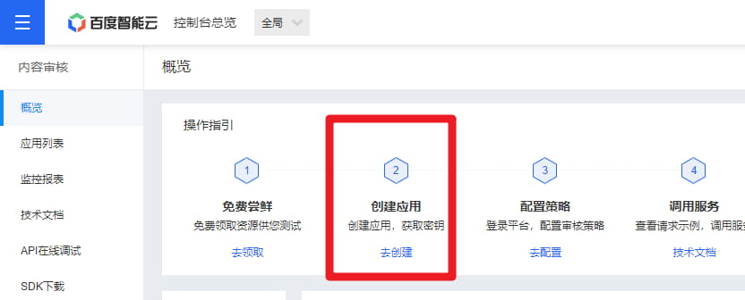

**4.应用名称随意。接口选择按默认，不用管。应用归属选个人。应用描述随意。**

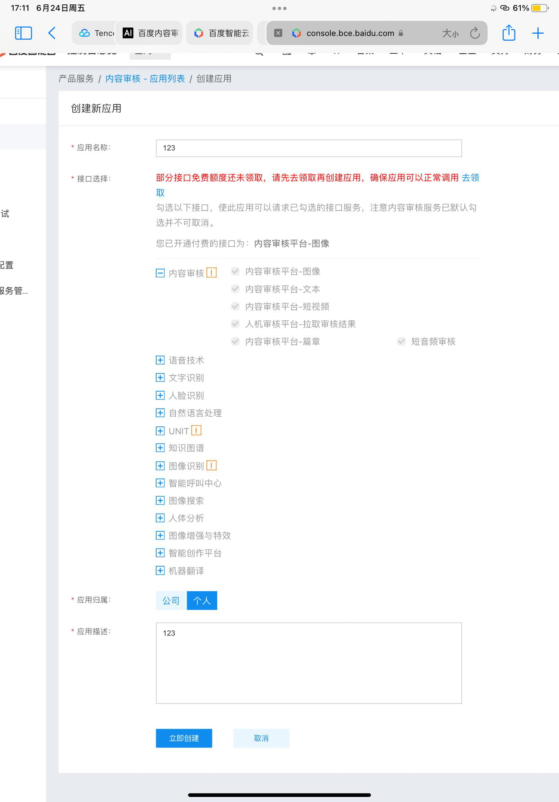

点**立即创建**

**5.创建后，点“配置审核策略”**

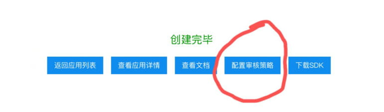

**6.点“创建策略”**

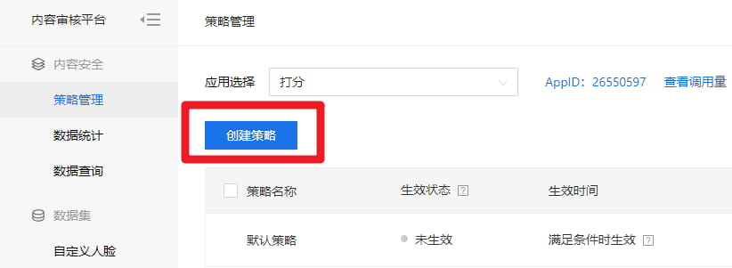

**7.填写策略名称及其他信息，确认应用ID为刚才创建的应用ID**

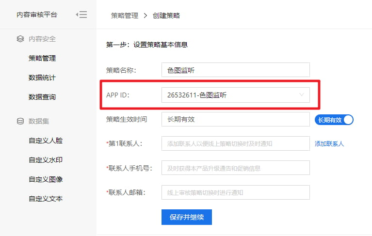

**保存并继续**

**8.****仅保留****“色情识别”项，****取消全部****其余项。“色情识别”的子项按需勾选和设置阈值。**

**图片达到黄色滑块所指阈值时，会触发色图监听。**

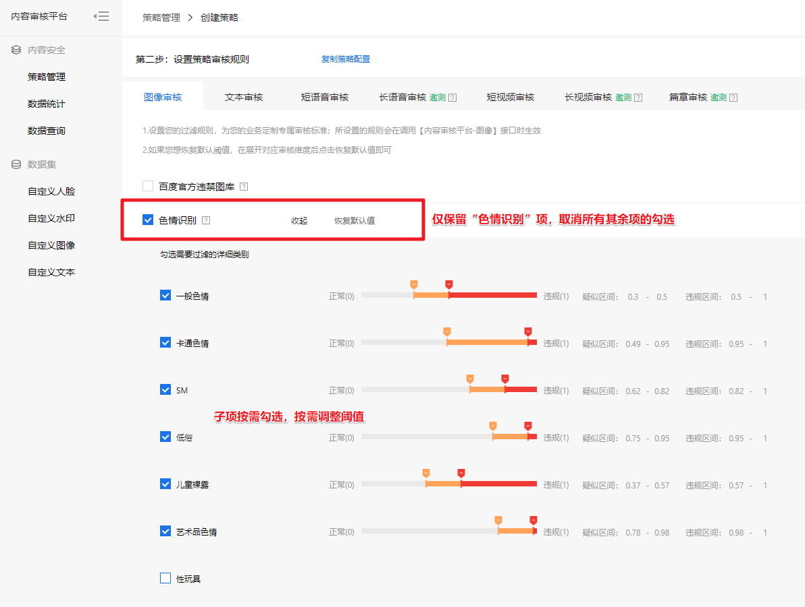

**9.依次点开“文本审核”、“短语音审核”等剩余页签，将其下方的检测项****全部取消****勾选**

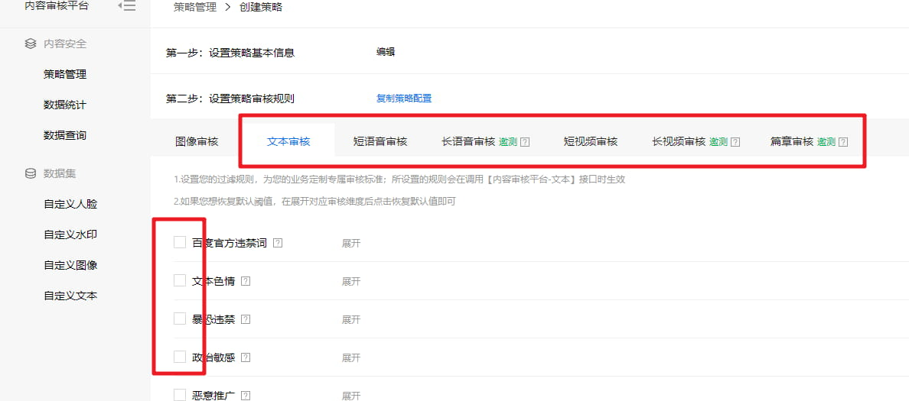

**9.5最后点“生成策略”**

**10.回到策略管理，启用刚才生成的策略**

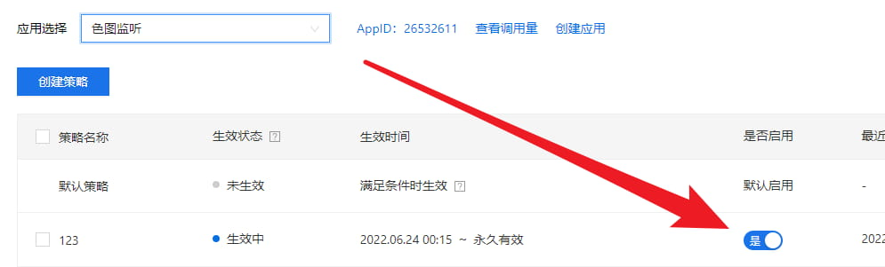

**11.回到应用列表，复制APP\_ID, API\_KEY, SECRET\_KEY**

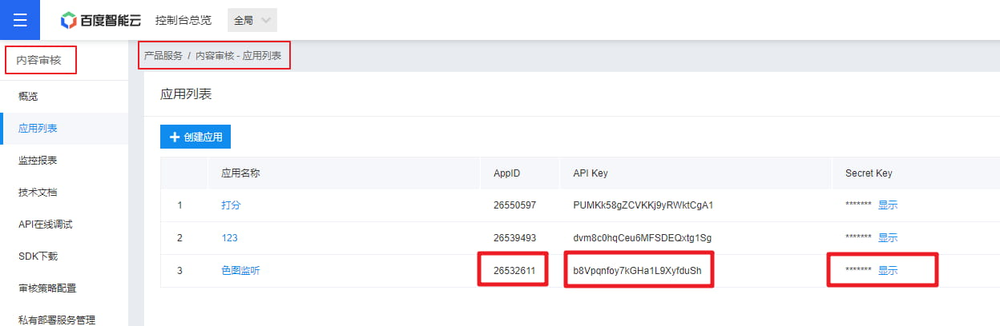

## 12.配置key

发送如下指令来配置：

-   \#ap设置百度appid你刚才获取的appid
-   \#ap设置百度apikey你刚才获取的apikey
-   \#ap设置百度secretkey你刚才获取的secretkey

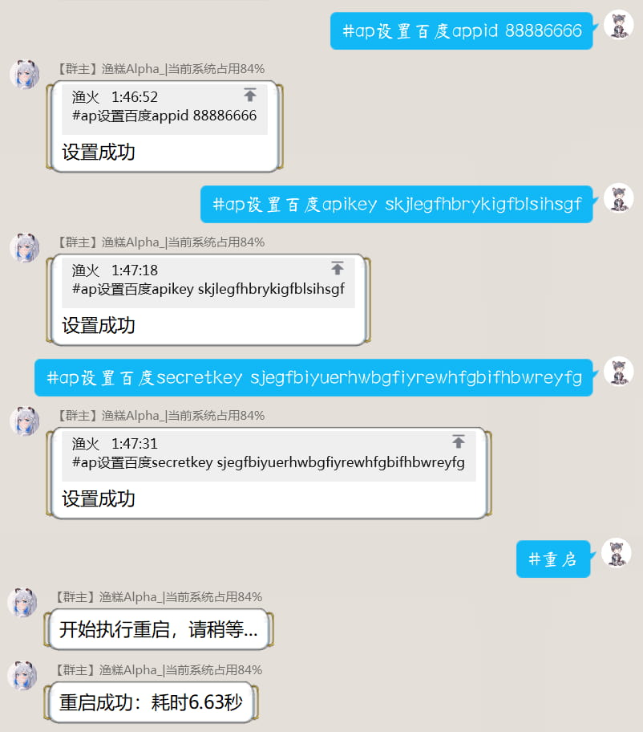

然后重启机器人即可
