# GPT生成Prompt配置文档

## 1.ChatGPT注册

要成为`ChatGPT`的玩家之一首先必须要注册自己的一个账号

-   **问题一：网络要求**

但由于不可明说的限制存在，导致许多潜在玩家的注册门槛都比较高（连接不上全球知名搜索引擎的读者自行解决网络问题哈～）

尽量能去到其它地方“旅行”顺便注册就更好了（代理香港可能不行，建议新加坡or美国）

-   **问题二：手机号**

由于`ChatGPT`官方的限制，我们需要有一个国外的手机号才能完成注册流程，很多技术圈、科技圈的小伙伴可能瞬间就能想到GV（GoogleVoice），但大部分的虚拟号都已经能够被ChatGPT官方的校验机制检测出来并拒绝注册，这里可以考虑使用比较出名的`接码`平台进行注册

接码平台：平台提供多个国家的大量手机号码接收语音通话以及短信的功能，挑选好一个国家并获得一个手机号的临时接收短信的权限即可进行各平台注册流程

Link-1：[sms-activate.org](https://link.juejin.cn?target=https://sms-activate.org "sms-activate.org")

Link-2：[sms24.info/en/messages…](https://link.juejin.cn?target=https://sms24.info/en/messages/OpenAI "sms24.info/en/messages…")

其它：

`SMS Receive Free`：这个站点只提供加拿大和美国的号码，每个国家有14个号码可供使用。每天都会有一个新的号码上线，并且会把最后一个号码替换掉，这意味着每个号码至少可以使用14天。它是免费的

`Receive-Sms-Free.cc`：提供了200多个临时或虚拟电话号码，涵盖30多个国家，包括美国、英国、加拿大、澳大利亚和许多其他国家

`SMS-MAN`：这个网站提供了数百个国家的号码，每个号码都需要支付少量的费用，如果无法使用，可以进行退费，但退回的费用只能留在后台，无法取出

`Receiveasms`：提供美国，加拿大，英国，巴西，澳大利亚的号码，有4个收费标准：12/每月，12/每月，12/每月，20/每月，30/每月，30/每月，30/每月，40/每月。

`ReceiveSMS.co`：提供美国，加拿大，英国，瑞典的在线免费号码

`FreePhoneNum`：免费提供美国和加拿大号码

`myTrashMobile`：提供美国、英国、加拿大的免费号码，但是你收到的验证码会显示在他们网站的首页

`SMS-Online.co`：免费提供美国，波多黎各，马来西亚，英国，瑞典的开放式手机号码

`US-Phone-Number.Com`：提供免费的美国和法国手机号码用以进行短信验证

`Temporary Phone Number`：提供临时免费的美国，法国，英国，爱尔兰，荷兰，东帝汶，加拿大，比利时，德国，瑞典手机号码

`SMS24.me`：免费提供包括美国在内的来自世界各地的手机号码

在接码平台注册完成后，自行进行账号充值，平台支持支付宝进行支付

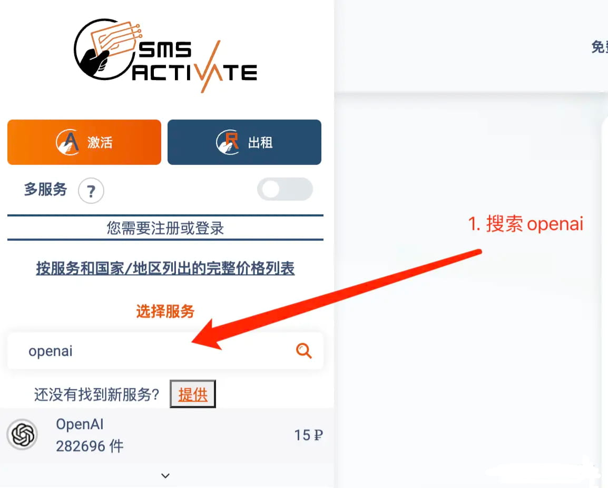

## 成功下单借用手机号接收功能后，在页面中间即可看到一个手机号码对应一个消息列表，这个时候返回到注册流程的手机号验证处输入已经借到的国外手机号码进行验证即可

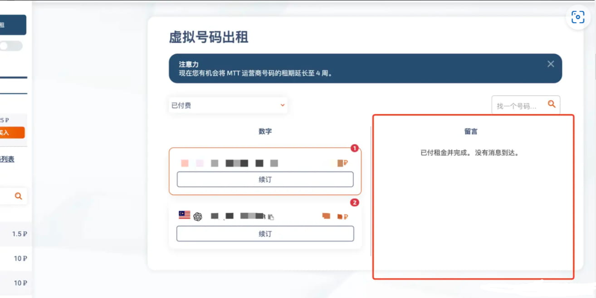

> 解决好以上两个问题后我们就能开始进行`ChatGPT`的账号注册

## 2.进入正式版本官方注册网站

URL：[https://link.juejin.cn/?target=https://chat.openai.com/auth/login](https://link.juejin.cn/?target=https://chat.openai.com/auth/login "https://link.juejin.cn/?target=https://chat.openai.com/auth/login")

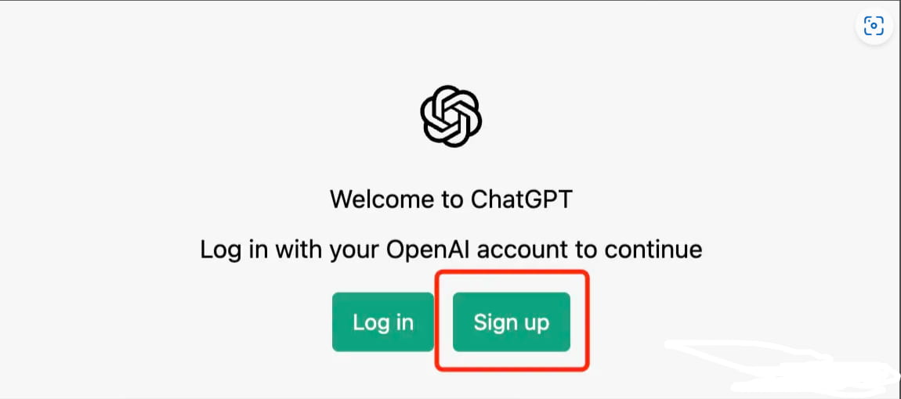

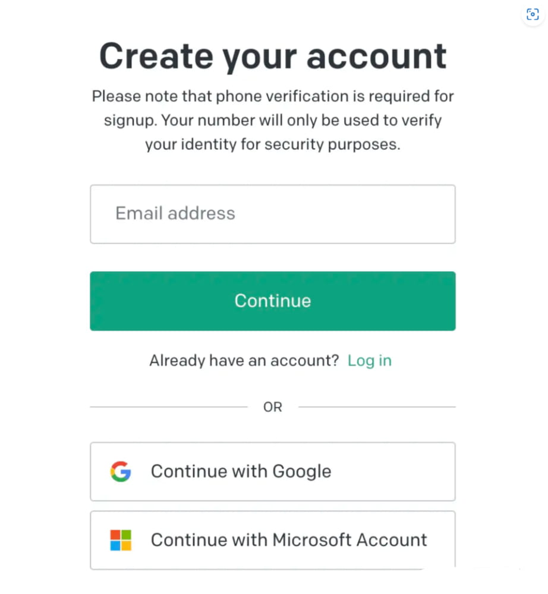

## 此处输入自己的邮箱，当然也可以直接使用Google或者微软的账号

## 授权登陆绑定若通过邮箱进行注册则会要求进行密码设置以及邮箱验证

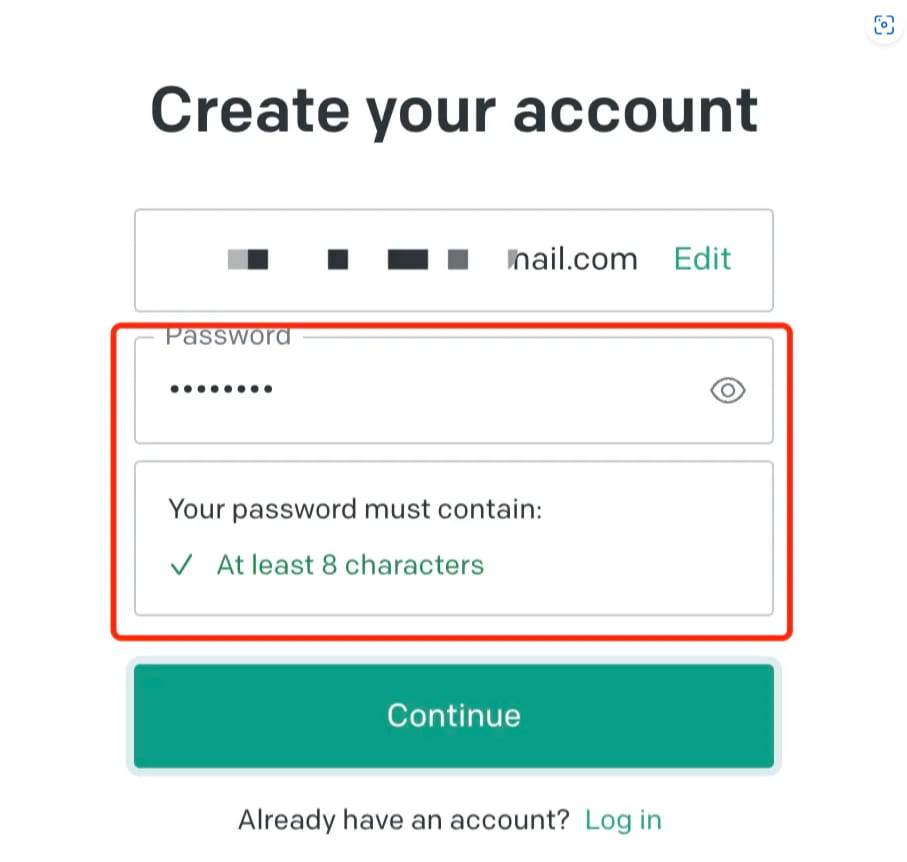

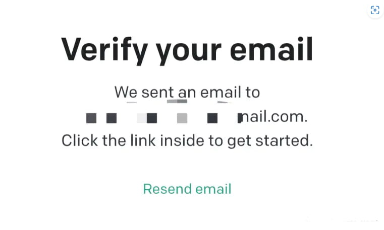

## 通过验证后就到了手机号注册流程，这里选择接码平台上手机号的国家以及输入接码平台已经准备好的手机号确认即可，接码平台网页刷新后便能拿到验证码&#xA;&#xA;

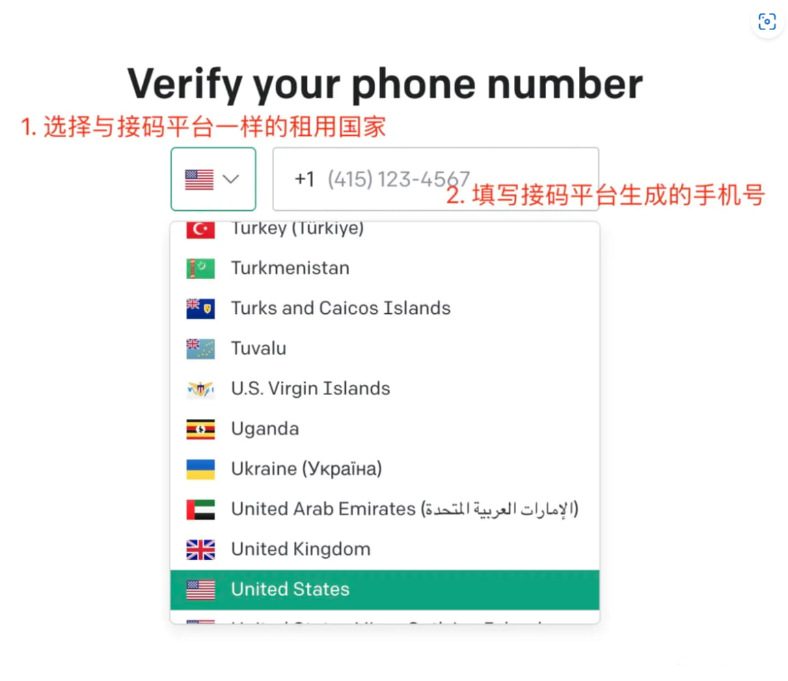

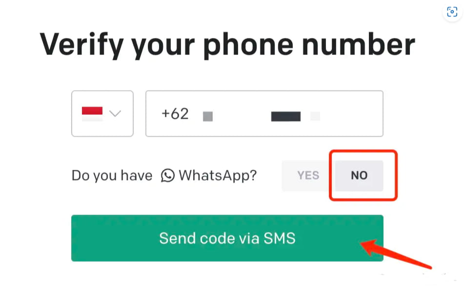

## 最后大功告成！！！～

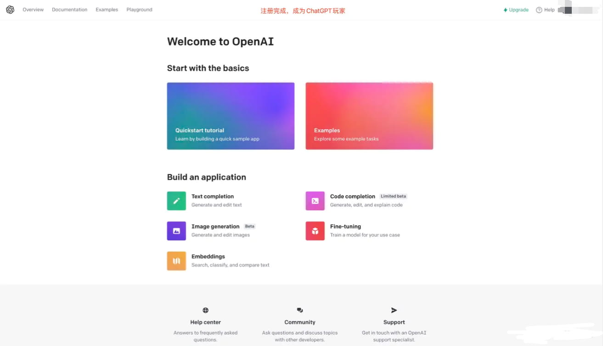

## 关于费用

-   前三个月有5美元的免费信用额度
-   一个token相当于四个字符
-   单个API请求最多只能处理2048个token(大约1500个单词)
-   GPT3.5模型费用：`0.002刀/1K个token`

## 3.接下来获取APIKEY

## [点击链接获取apikey](https://platform.openai.com/docs/quickstart/build-your-application "点击链接获取apikey")

获取密钥方法也比较简单，前往网址并点击图中：`create new secret key`

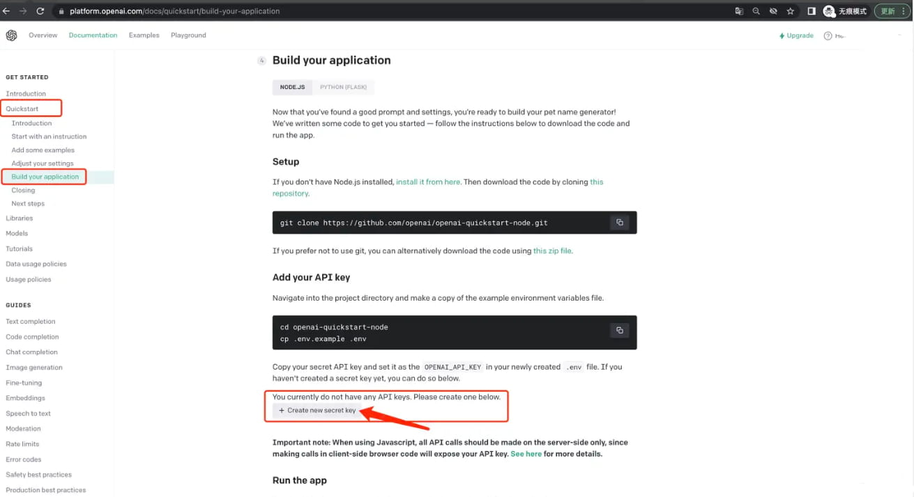

## 随后获得一个sk开头的字符串（API密钥）

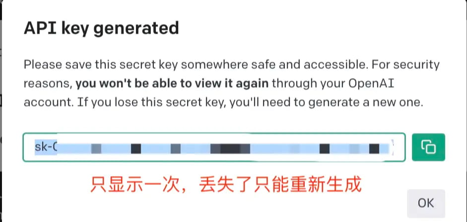

## 4.给你的bot填写apikey

获取完成后给你的bot发送

**#ap设置OpenAI密钥****sk-xxx****用于#处理xxx**

0C(6D2C_T6vJYOsKDz.jpg)

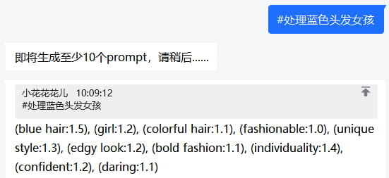

本篇教程By——小花花花儿（860563585）
