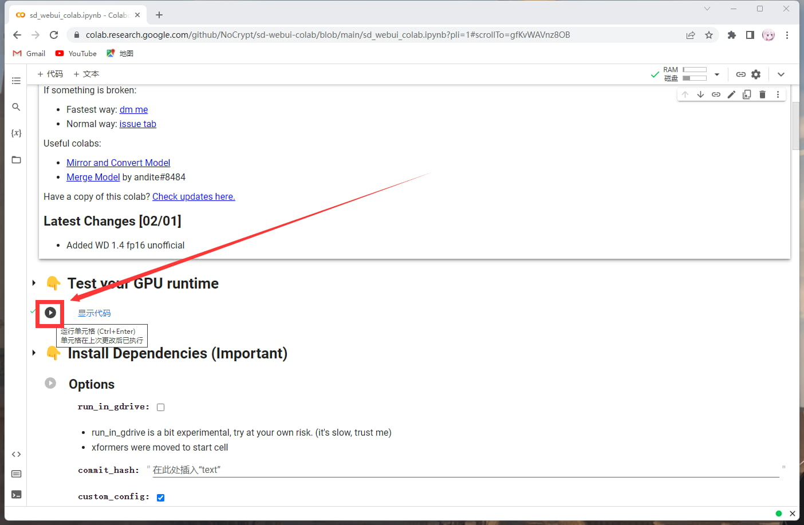

# 绘图服务端部署文档

## \*\* PS\*\*：云服务器与轻量云服务器是不能部署的

## 本地部署

-   需要一张NVIDIA GeForce GTX 1660[以上](https://vga.zol.com.cn/soc/ "以上")的显卡，显存6GB以上
-   需要硬盘空间≧**100GB**（按照所需模型选择硬盘空间越多所需硬盘空间越大）

## 步骤一：下载文件

1.  【novelai-webui一键包】[下载链接](https://pan.baidu.com/s/1TK7UyX5lgNjdwdfcmYCI5Q?pwd=c132 "下载链接")    By秋葉aaaki
2.  【驱动程序】[下载链接](https://www.nvidia.cn/Download/index.aspx?lang=cn "下载链接")   （应该不会有人不装驱动吧！）
3.  【CUDA】[下载链接](https://developer.nvidia.com/cuda-downloads "下载链接")   （生成图片速度更快）
4.  （可选）【cuDNN】[下载链接](https://developer.nvidia.com/rdp/cudnn-download "下载链接")   （需要登录账号下载，生成图片速度更快）

## 步骤二：安装驱动，CUDA与cuDNN

教程网上都有，这里不做过多赘述，仅放几篇教程仅供参考

1.  安装显卡驱动：

    <https://zhuanlan.zhihu.com/p/354742852>
2.  安装CUDA与cuDNN：

    <https://zhuanlan.zhihu.com/p/94220564>

## 步骤三：解压与存放

1.  将【novelai-webui一键包】解压，如图所示：

    
2.  解压完成后，进入【sd-webui-aki-v4】根目录，往下滑找到【A启动器.exe】：

    
3.  双击打开，如图所示：

    

## 步骤四：使用启动器

1.  点击【高级选项】，查看【生成引擎】是否已经显示你的显卡型号，如果没有请检查驱动是否安装成功

    
2.  往下滑，找到【监听设置】，打开开放远程连接：

    
3.  点击右上角的【一键启动】，等待启动完成：

    

-   **我的机器人不在此电脑上****（这个是可以点开的）** ​

    如果你的机器人不在部署的这台电脑上，请勾选通过Gradio共享，如图所示

    

    勾选后会使用Gradio的内网穿透，该链接每次重启时会刷新，且72小时会刷新一次，若你想获取持久化链接，请自行内网穿透，这里推荐Sakura Frp：

    <https://www.natfrp.com/user/>

    SakuraFrp教程：
    1.  自行注册后，来到主页面：

        
    2.  点击【服务】，软件下载，下载【启动器】：

        

        
    3.  回到主页，点击【查看访问密钥】，复制下来粘贴到启动器登录：

        

        
    4.  创建一个隧道，点击【隧道】，然后点加号，在弹出的框左侧找到端口为【7860】的进程，点击它：

        PS：先启动Stable Diffusion才会有这个进程，如果没有先启动

        
    5.  随便填一个名称，选择穿透节点（建议国外）：

        
    6.  创建成功后，我们打开隧道，再从日志中取出远程地址：

        

        
    7.  这个就是你的接口地址了，你可以使用
        ```javascript
        #ap添加接口http://202.182.125.24:46349/备注我的接口

        ```
        PS：记得带上Http，如果不能正常连接就换穿透节点

1.  回到一键启动页面，点击一键启动，随后启动成功的话，会自动打开一个网页，复制该网页的链接，这就是你的Stable Diffusion 接口，请妥善保管

    

    如果你机器人与绘图服务器在同一台电脑上，请使用：
    ```javascript
    #ap添加接口http://127.0.0.1:7860/备注我的接口

    ```
    如果你机器人与绘图服务器不在同一电脑上，则使用下面的长一点的链接：
    ```javascript
    #ap添加接口https://xxxxxxxxxxxxx.gradio.live/备注我的接口
    ```
    PS：

    
2.  绘图期间保证你的电脑不能关闭，且控制台窗口（那个黑黑的窗口）也不可关闭，关闭后接口将失效。

## 服务器部署（特指GPU型服务器）

> 📌目前腾讯GPU服务器已经涨价到了798元/月，非常的贵，不建议这个时段购买，秒杀有45元15天的服务器，可以买来玩玩

<https://cloud.tencent.com/act/pro/gpu-study>

## Colab部署

-   此方法需要使用到魔法
-   Google Colab中的GPU资源每天只能运行6个小时（可能会更短）
-   不可关闭浏览器，关闭后接口立即失效

## 步骤一：打开魔法

1.  使用代理工具（比如Clash）

    
2.  访问下方链接

    <https://colab.research.google.com/github/NoCrypt/sd-webui-colab/blob/main/sd_webui_colab.ipynb>

## 步骤二：登录Google账号

1.  点击右上角蓝色按钮登录，请自备Google账号

    
2.  登录成功

    

## 步骤三：运行代码

1.  我们点击 Test your GPU runtime，检查是否分配到了GPU

    
2.  可以看到，很幸运我分配到了一块NVIDIA T4，显示GPU Connected!我们就可以继续下一步了

    
3.  来到Install Dependencies (Important)，点击运行代码

    
4.  提示连接到Google云端硬盘，我们选择连接

    
5.  等待代码块运行完毕后，我们来到Install Models这一栏，这里我仅选择Anything模型，需要其他模型请自行勾选，选择好模型后点击运行代码块

    
6.  等待代码块运行完毕后， 我们来到Start webui这一栏，详细参数如图所示，选择好后点击运行代码块

    
7.  如果如图所示有了public URL，就表示成功了，这就是你的Stable Diffusion 接口，请妥善保管

    
8.  请保证你的浏览器窗口开启，关闭后会回收资源

## 我们的免费接口

-   我们为了方便没有能力的用户也能使用本插件，我们提供了一个免费的接口
-   [进入爱发电查看免费接口](https://afdian.net/a/sumoqi "进入爱发电查看免费接口")

    <https://afdian.net/a/sumoqi>
-   尽管是免费的，但GPU服务器价格不菲，我希望您能给我一点小小的赞助，用来续费服务器
