# 大清晰术接口文档

> 📌为了不污染HuggingFace开源社区的空间，我们强烈建议使用已有的空间接口，你可以不需要自己部署，直接使用以下命令即可使用本功能，配置完成后请记得重启生效：
>
> ```javascript
> #ap设置大清晰术接口https://dianxian-real-cugan.hf.space/api/predict
> ```

如果您仍需要自己部署，可继续查看以下内容

***

## 步骤一

使用浏览器打开Huggingface网站：

[Hugging Face – The AI community building the future.](https://huggingface.co/ "Hugging Face – The AI community building the future.")

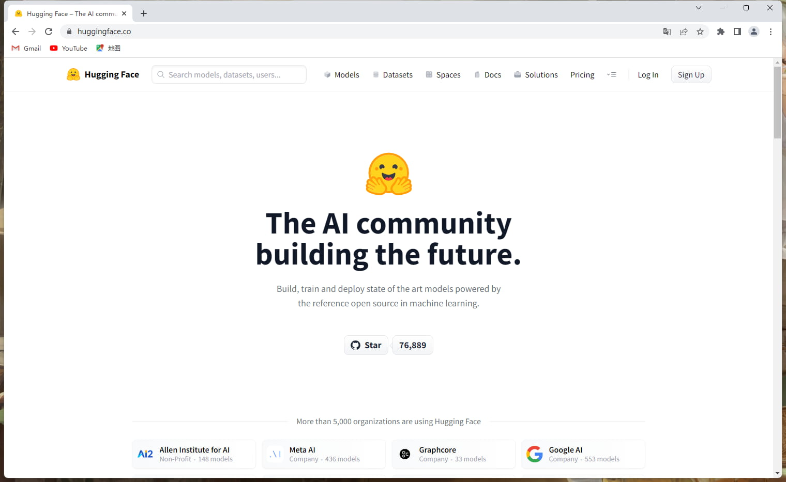

***

## 步骤二

点击右上角**Sign Up**进行注册

> 若您已经注册过Huggingface账号，请跳转至步骤六

输入自己的邮箱，并设置好密码，点击Next

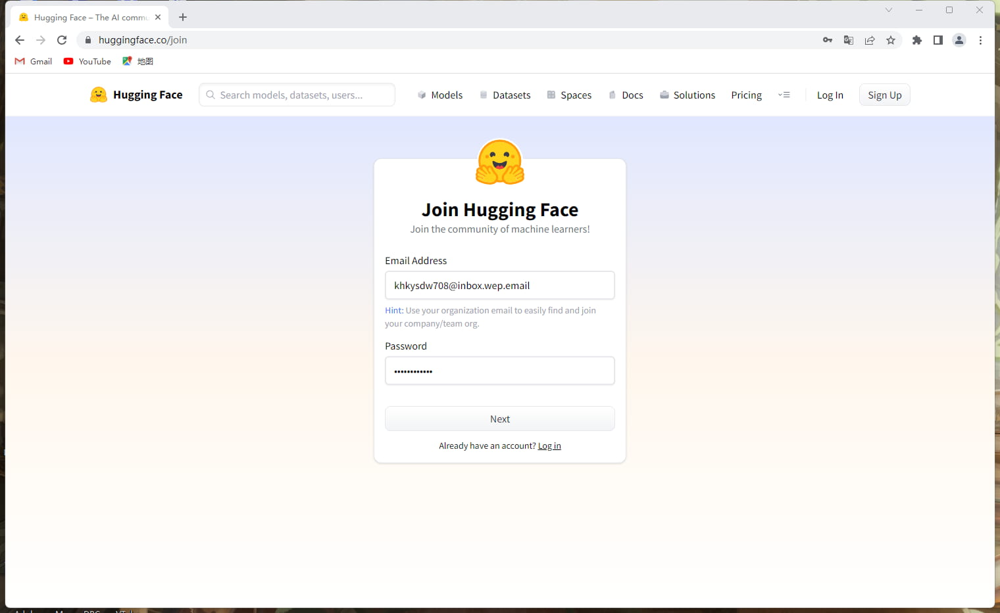

***

## 步骤三

设置自己的Username与Full name，并勾选

-   [x] I have read and agree with the Terms of Service and the Code of Conduct

最后点击Creat Account

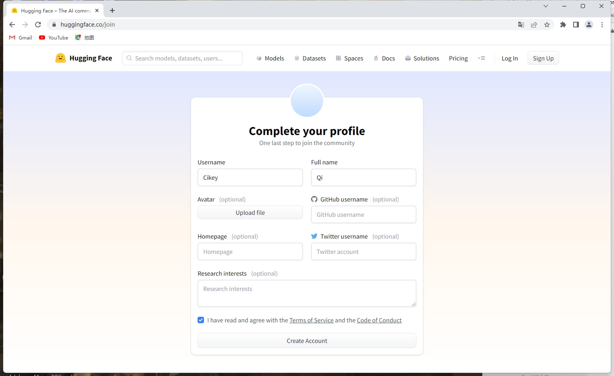

***

## 步骤四

点击页面黄条（Please check your email address for a confirmation link）右侧的Resend confirmation email按钮，将验证信息发送到你的邮箱

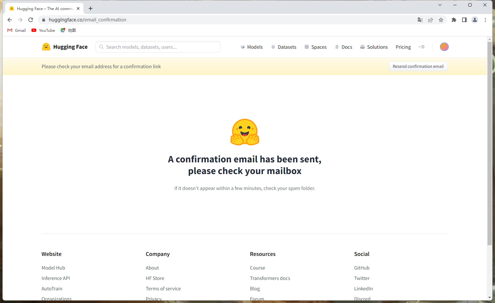

***

## 步骤五

登录邮箱，打开Hugging Face的邮件，里面有一条链接，打开它

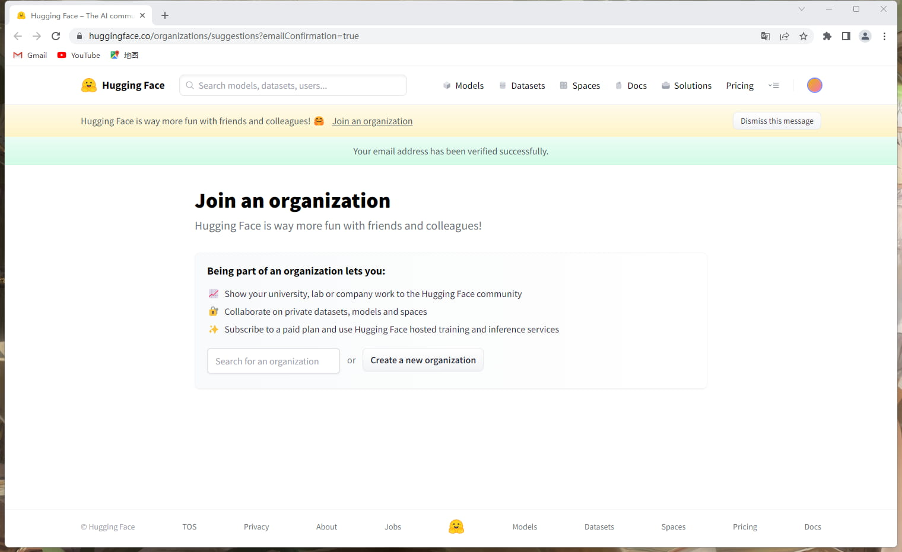

页面绿条显示Your email address has been verified successfully.就意味着您注册成功了

***

## 步骤六

用相同浏览器打开下方网站：

[Real CUGAN - a Hugging Face Space by DianXian](https://huggingface.co/spaces/DianXian/Real-CUGAN "Real CUGAN - a Hugging Face Space by DianXian")

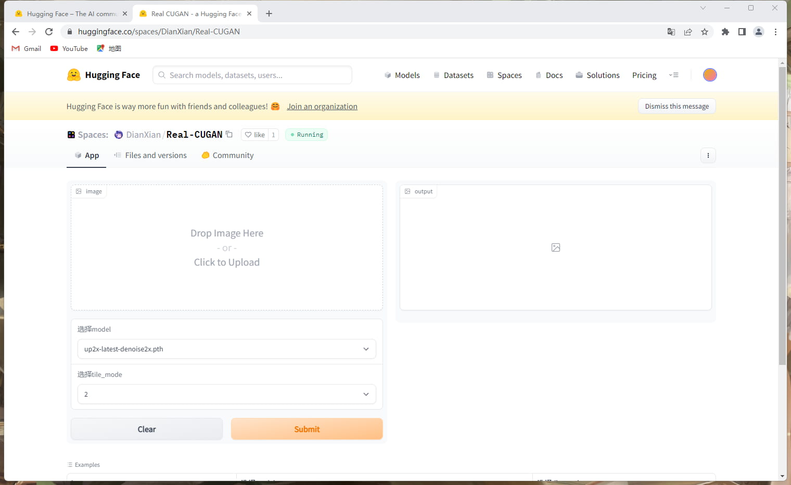

***

## 步骤七

点击右上角竖着排列的三个点，选择第二项Duplicate this Space

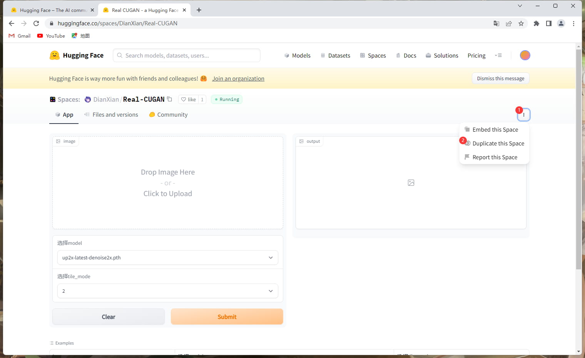

***

## 步骤八

修改Visibility，将Private改成Public，然后点Duplicate Space按钮即可

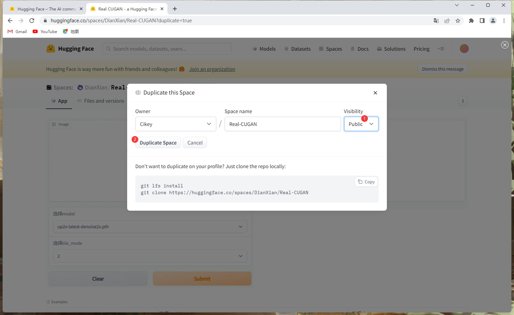

***

## 步骤九

等待其蓝色的Building变成绿色的Running

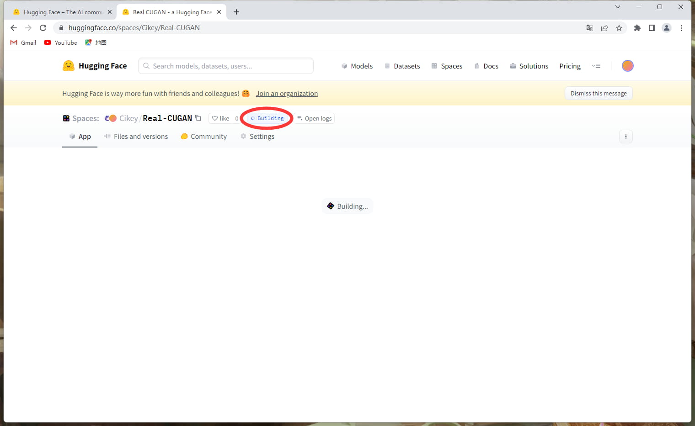

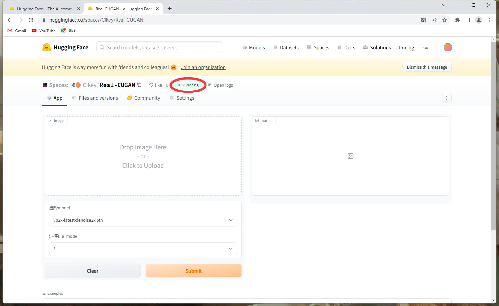

***

## 步骤十

下滑页面至最低端，最下方有一个view api，点击它，在Full URL的右侧就是你的API了，点击copy即可复制

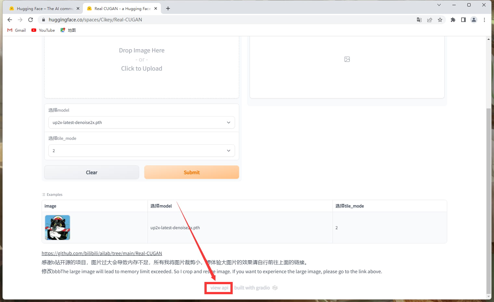

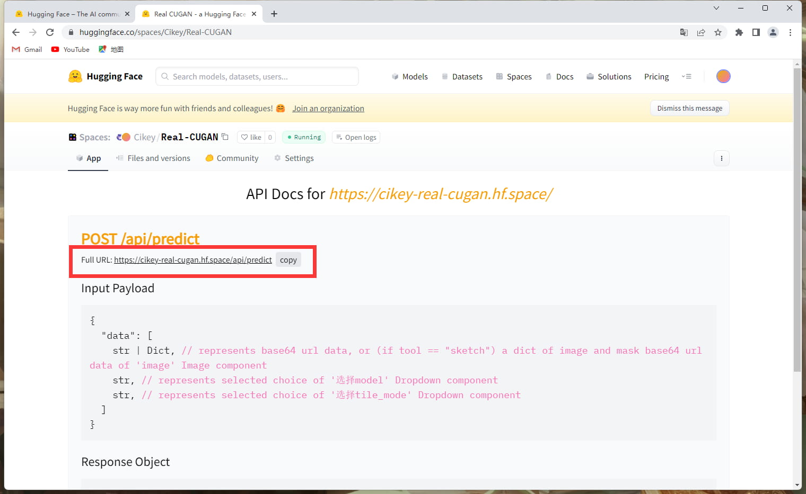

## 步骤十一

对机器人发送  #ap设置大清晰术接口你的接口
